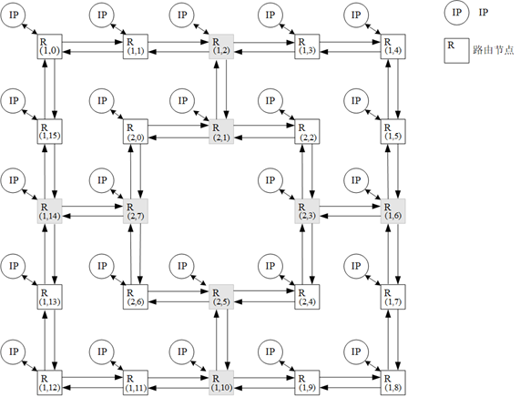
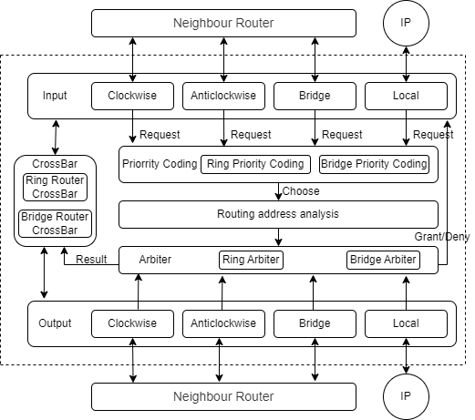
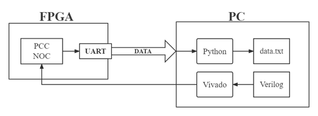

# BoChen-Ye-Network-on-Chip-Router-Based-on-Packet-Connected-Circuit
This is my bachelor graduation project. It's a Network on Chip using by Verilog HDL. This 2D-Mesh NoC based on packet connected circuit.

## Double-Ring Packet-Connected-Circuit NoC:
Implement the router and routing algorithm of PCC-NoC by using **VerilogHDL**.
Verify it on FPGA and use UART(with FIFO) to communicate with PC.
- PCC don't need buffer
- Double-Ring topology can use less hardware resource than Mesh
- Fault-tolerant routing algorithm

